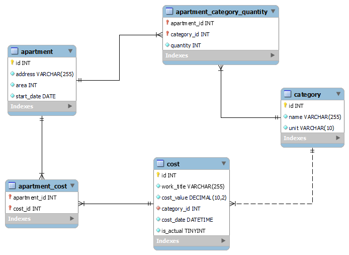

# Estimator: Сметный Калькулятор
### Технологии
Java SE + Spring Framework + Hibernate + MySQL + Maven + Git + Docker

### Описание
Estimator - web-приложение для расчета смет. 
<br/>
Предоставляет пользователям возможность управлять 
проектами, вести учет данных о характеристиках объектов 
и стоимости работ и рассчитывать итоговые затраты.
<br/>
Удобна для использования Главными инженерами
компаний по ремонту и отделке помещений.

### Функциональность
- Учет объектов, по которым заключаются договоры на ремонт;
- Ввод, редактирование данных о характеристиках объектов;
- Ведение Справочника цен на работы;
- Автоматический расчет Сметы по объекту;
- Сбор Статистики: вывод общей стоимости работ по всем объектам,
итоговых сметных цен в разрезе объектов, итоговых цен 
в разрезе видов работ, мониторинг изменения цен по всем видам работ.

  
### Особенности текущей версии приложения
- Реализована группировка характеристик объектов  на 8 _Категорий_: 
полы, потолки, стены, плинтуса, двери, точки отопления, точки электрики, 
точки сантехники;
- Виды работ, на которые назначаются цены, также привязаны
к данным 8-ми _Категориям_. К одной _Категории_ могут быть
привязаны несколько видов работ; 
- Расчет Сметы производится на основании введеных данных
о характеристиках объекта (_Категориях_) и выбранных видах работ,
которые необходимо выполнить на данном объекте. При этом к включению
в смету доступны только те виды работ, которые привязаны к _Категориям_,
для которых внесены данные по объекту. После выбора работ 
выполняется автоматический расчет Сметы и итоговой стоимости по объекту;
- При изменении цены работы в Справочнике цен информация о предыдущих 
значениях цен из БД не удаляется;
- Реализована возможность автоматического пересчета Сметы в текущие цены 
при изменении в Справочнике цен стоимости одного или нескольких видов работ.

### Схема БД



Таблицы apartment_category_quantity и apartment_cost 
используются для реализации связей "many to many":

- apartment_category_quantity: связь между apartment(объект) 
и category(категория/характеристика) с дополнительным атрибутом 
quantity, который отражает количество по каждой характеристике;
- apartment_cost: связь между apartment(объект) и cost(цена) -
отображает виды работ (по заданным ценам), которые необходимо выполнить
на каждом объекте.

### Установка и запуск
Для запуска предпочтительно установить Docker Desktop (скачать
можно с официального сайта 
https://www.docker.com/products/docker-desktop/)

1. Клонируйте репозиторий проекта:
```
git clone https://github.com/onopina/estimator.git
```
2. В Командной строке перейдите в корень директории с проектом.
3. Соберите проект:
```
mvn clean package
```
4. Запустите приложение:
```
docker-compose up 
```
Команда запустит два контейнера:
MySQL на порту 3307 и Estimator App на порту 8080.
5. Перейдите по адресу: http://localhost:8080 в браузере, 
чтобы получить доступ к приложению Сметный Калькулятор.
